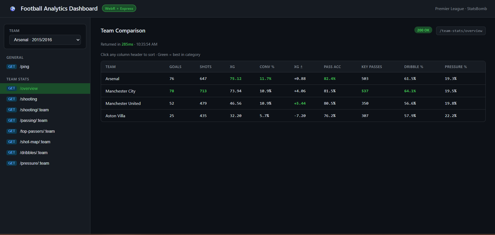

# Football Analytics: WebR + Express

R's statistical power inside a Node.js/Express backend — **no R installation required**. R runs as WebAssembly via [`webr`](https://docs.r-wasm.org/webr/latest/). Data is sourced from the [StatsBomb Open Data](https://github.com/statsbomb/open-data) API.



---

> **Data Attribution**
> Whilst we are keen to share data and facilitate research, we also urge you to be responsible with the data. Please credit StatsBomb as your data source when using the data and visit [statsbomb.com/media-pack](https://statsbomb.com/media-pack/) to obtain their logos for public use.

---

## Requirements

- Node.js ≥ 18
- R (for running the dataset generator in RStudio / Positron)
- R packages: `dplyr`, `jsonlite`, `StatsBombR`

---

## Setup

```bash
npm install
```

> First run downloads R packages (`dplyr`) once and caches them to `r-library/`. Later runs load from disk — no network needed.

---

## Generating a Dataset

Datasets are generated using `r/dataset_generator.qmd`

**1. Find your competition and season IDs**

```r
library(StatsBombR)
FreeCompetitions()
```

**2. Set the constants at the top of the file**

```r
COMP_ID    <- 2       # e.g. Premier League
SEASON_ID  <- 27      # e.g. 2015/2016
TEAM_NAME  <- "Arsenal"
DATASET_DIR <- "./data"
```

**3. Run all chunks top to bottom**

This pulls matches + events from the StatsBomb API, merges match context (opponent, date, score) into each event row, slims to the required columns, and saves two files to `data/`:

```
data/
  2_27_arsenal.rds      ← event data
  2_27_arsenal.json     ← metadata (team, season, match list)
```

Repeat for as many teams/seasons as you want. The server picks up all `.rds` files automatically on next start.

---

## Run

```bash
node ./index.js
```

Open [http://localhost:3000](http://localhost:3000) in browser. Select a team from the dropdown and click any endpoint in the sidebar.

---

## API Endpoints

All endpoints are under `/team-stats`.

| Method | Endpoint                          | Description                                                                                                           |
| ------ | --------------------------------- | --------------------------------------------------------------------------------------------------------------------- |
| GET    | `/team-stats/datasets`          | All available datasets — reads JSON metadata, no R involved                                                          |
| GET    | `/team-stats/overview`          | **Multi-team comparison** — sortable table across all loaded datasets (shooting, passing, dribbling, pressure) |
| GET    | `/team-stats/overview/:team`    | Single team overview — stat cards by category                                                                        |
| GET    | `/team-stats/shooting`          | Shooting summary grouped by all teams in the data                                                                     |
| GET    | `/team-stats/shooting/:team`    | Player shooting breakdown for a specific team                                                                         |
| GET    | `/team-stats/passing/:team`     | Pass accuracy summary                                                                                                 |
| GET    | `/team-stats/top-passers/:team` | Top 10 passers by volume                                                                                              |
| GET    | `/team-stats/shot-map/:team`    | SVG pitch shot map — locations, xG, outcomes, filterable by result                                                   |
| GET    | `/team-stats/dribbles/:team`    | Dribble success rate by player                                                                                        |
| GET    | `/team-stats/pressure/:team`    | Actions performed under pressure by type                                                                              |

> **Note:** The comparison endpoint (`/overview`) only includes teams with a fully generated dataset. Opponent teams that appear partially in the data are excluded automatically.

---

## Adding R Packages

Add package names to the `PACKAGES` array in `webRInstance.js`. They download once on first run and are cached to `r-library/`.

```js
const PACKAGES = ["dplyr", "your-package"];
```
